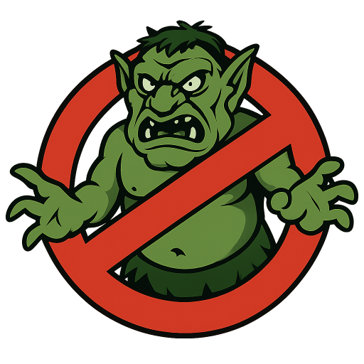
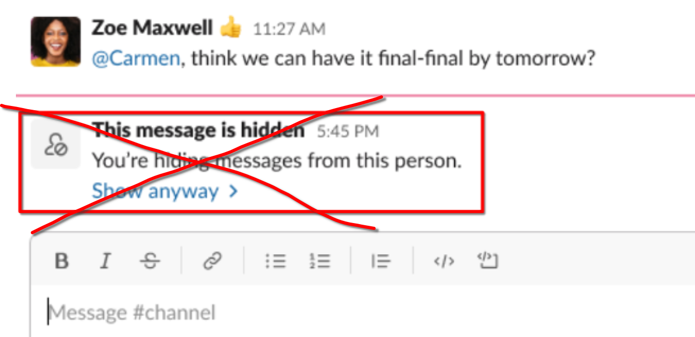

# trollbuster-slack-chrome

A minimal Chrome extension to *really* hide Slack messages from users that you have blocked. Works on the Web UI and the unofficial Slack PWA.

## what?

In 2023 Slack introduced a feature that allows you to [block other users](https://slack.com/blog/news/new-hide-person-feature). This is great for blocking trolls and scammers on public Slack communities.

However, messages from blocked users still appear in channels, replaced with `This message is hidden`. **This Chrome extension hides such "hidden" messages entirely.**

## good to know
- you might still see messages from other users at-ing the blocked user (`@hidden user: <something>`)
- you can´t see or access threads below messages from the blocked user. (Collateral damage, but I like it that way).

## installation

- copy folder `trollbuster-slack-chrome` to a local folder
- in chrome go to `chrome://extensions`, enable developer mode
- click `load unpacked` and select the `trollbuster-slack-chrome` folder

